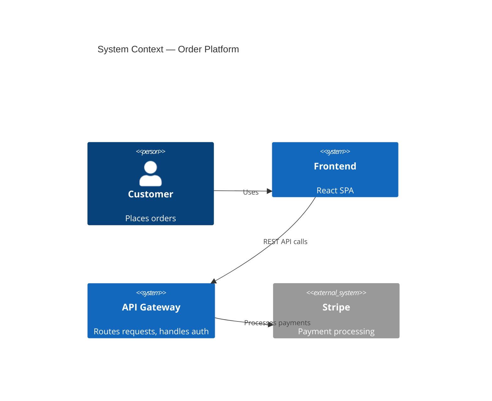

# Documenting Multi-Repo, Multi-Layer Systems for Agentic AI Development

> Research date: May 2026 | 25 sources | Evidence graded throughout

---

## The Core Problem

Cross-repository features fail in **68% of enterprise deployments** because agents lack architectural visibility (AugmentCode, 2025). The root causes are always the same: agents hallucinate APIs that don't exist, violate layer boundaries, duplicate code that already exists elsewhere, or generate code against stale documentation. Good documentation architecture prevents all of these.

AGENTS.md files reduce agent runtime by **29%** and improve task success rates (Lulla et al., arXiv:2601.20404, 2026). But loading too much context degrades performance — ETH Zurich found that oversized context files reduced success rates ~3% and increased inference costs 20–159%.

---

## The Three-Tier Memory Model

The most validated framework (Vasilopoulos, arXiv:2602.20478, 2026 — **Strong**):

```
HOT MEMORY    → AGENTS.md / CLAUDE.md in each repo
               Always loaded. Universal rules, conventions, constraints.
               Keep under 500 lines. No procedures.

WARM MEMORY   → architecture.md, ADRs, OpenAPI specs, catalog-info.yaml
               Loaded on demand when the task matches.
               Detailed reference material the agent pulls when needed.

COLD MEMORY   → Full codebase, cross-repo docs, historical context
               Retrieved via semantic search or MCP tools.
               Never loaded wholesale — queried on demand.
```

---

## Documentation Architecture

### Level 1: System-level (cross-repo)

One central location — a dedicated `docs` repo, a wiki, or a `SYSTEM_MAP.md` at the org level.

```markdown
# SYSTEM_MAP.md

## Repos and responsibilities
| Repo | Owns | Provides | Consumes |
|------|------|----------|----------|
| frontend | UI, routing | — | api-gateway (REST) |
| api-gateway | Auth, routing | REST API (openapi.yaml) | user-service, order-service |
| user-service | User domain | gRPC user.proto | postgres, redis |
| shared-types | Contracts | TypeScript types, Protobuf | — |
| infra | Deployment | — | all services |

## Architectural layers
[Layer diagram — what can depend on what]

## Cross-repo change workflow
1. Change shared-types first (contract)
2. Implement in provider repo
3. Implement in consumer repos
4. Merge order: types → backend → frontend → infra

## Branch naming convention
All cross-repo changes use the same branch name: feature/<name>-<date>
```

### Level 2: Repo-level (AGENTS.md)

Every repo has its own `AGENTS.md` at the root. This is the hot memory — always loaded.

```markdown
# AGENTS.md — [repo name]

## Purpose
[One sentence: what this repo owns]

## Build and test
- Build: `npm run build`
- Test: `npm test`
- Lint: `npm run lint`

## Architecture
- Entry point: src/index.ts
- Layer structure: routes → handlers → services → repositories → db
- [What can depend on what — explicit layer rules]

## Conventions
- [Naming convention]
- [File structure rule]
- [Non-obvious constraint]

## API contracts
Provides: docs/openapi.yaml (v2.3.1)
Consumes:
  - user-service: github.com/org/user-service/blob/main/docs/openapi.yaml

## Shared utilities — DO NOT reimplement
- Date formatting: src/utils/date.ts
- Error handling: src/utils/errors.ts
- HTTP client: src/lib/http-client.ts

## DO NOT
- Call the database directly from route handlers (use the service layer)
- Import from sibling services directly (use the HTTP client)
- Add dependencies without updating catalog-info.yaml

## Security
- All DB queries MUST use parameterized statements
- Never log PII (user IDs, emails, tokens)
- All endpoints require auth middleware unless explicitly marked public
```

### Level 3: Module/feature-level (warm memory)

Loaded on demand when the task involves that module.

```
docs/
├── architecture.md          # C4 component diagram + layer rules
├── adr/                     # Architecture Decision Records
│   ├── 001-use-postgres.md
│   └── 002-event-sourcing.md
├── openapi.yaml             # API contract (if this repo provides an API)
└── modules/
    └── payments.md          # Deep-dive on the payments module
```

Reference these from AGENTS.md with explicit load conditions:
```markdown
Read [docs/architecture.md](docs/architecture.md) before making any structural changes.
Read [docs/modules/payments.md](docs/modules/payments.md) when working on payment flows.
```

### Level 4: Cold memory (on-demand retrieval)

For large systems, use MCP tools or semantic search rather than loading everything:

```python
# MCP tools for cross-repo context
list_subsystems()                    # What repos/subsystems exist?
get_files_for_subsystem(key)         # What files belong to this subsystem?
find_relevant_context(task)          # What docs are relevant to this task?
search_context_documents(query)      # Full-text search across all docs
suggest_agent(task_description)      # Which specialist agent handles this?
```

---

## What Goes Where

| Content | Location | Format | Updated by |
|---|---|---|---|
| Universal rules, conventions | `AGENTS.md` (each repo) | Markdown | Human, on change |
| System topology, repo map | `SYSTEM_MAP.md` (central) | Markdown table | Human, on change |
| Architecture diagrams | `docs/architecture.md` | C4 + Mermaid | Human, on change |
| Architecture decisions | `docs/adr/` | MADR format | Human, per decision |
| API contracts | `docs/openapi.yaml` | OpenAPI 3.x | Auto-gen from code |
| Type contracts | `shared-types` repo | TypeScript/Protobuf | Human, versioned |
| Dependency graph | `catalog-info.yaml` | Backstage YAML | Human + CI check |
| Directory structure | `docs/architecture.md` | Auto-generated section | CI hook |
| Schema definitions | `docs/schema/` | JSON Schema / Zod | Auto-gen from code |

**The split that all research converges on** (**Strong** — 4+ sources):
- **"What"** (schemas, signatures, directory structure, dependency graph) → auto-generate from code via CI
- **"Why"** (decisions, constraints, trade-offs, known failure modes) → human-written, never auto-generated

---

## Cross-Repo Coordination Patterns

### The Shared Contract Pattern (**Strong** — 3+ sources)

```
shared-types repo  ← single source of truth for all contracts
backend repo       ← implements contracts
frontend repo      ← consumes contracts
infra repo         ← verifies end-to-end
```

Merge order is non-negotiable: **types → backend → frontend → infra**. Agents violate this constantly without explicit documentation.

### One Agent Per Repo (**Strong** — 3+ sources)

Never let one agent clone five repos and work across all of them in one session. Context bleed is severe. The pattern that works:

- One agent per repo, scoped task per agent
- A coordinator (human or orchestrator agent) holds the cross-repo view
- Parallel execution, sequential merge in the defined order
- Every agent gets the pre-written AGENTS.md for its repo

### Hierarchical AGENTS.md (**Strong** — 3+ sources)

For monorepos or repos with multiple services:

```
/AGENTS.md                    ← universal rules (applies everywhere)
/packages/api/AGENTS.md       ← API-specific rules (overrides root where specified)
/packages/frontend/AGENTS.md  ← Frontend-specific rules
/packages/shared/AGENTS.md    ← Shared library rules
```

Nearest file wins. Root file sets defaults. Leaf files add specifics without repeating the root.

---

## Architecture Diagram Format

C4 model with Mermaid.js is the recommended format (**Moderate** — 2 sources): text-based, version-controllable, renderable in GitHub/GitLab without tooling.



Keep diagrams in `docs/architecture.md` in each repo. The system-level diagram lives in the central `SYSTEM_MAP.md`.

---

## ADRs as Agent Constraints

ADRs are not just historical records — for agents they are **executable constraints** (**Moderate** — 3 sources). An agent that doesn't know about ADR-003 (use the repository pattern, never call the DB from handlers) will violate it on every task.

Reference accepted ADRs explicitly in AGENTS.md:
```markdown
## Architectural constraints (see docs/adr/ for full context)
- ADR-001: PostgreSQL for primary storage — do not introduce other databases
- ADR-003: Repository pattern — never call the DB from route handlers
- ADR-007: All inter-service communication via HTTP — no direct DB sharing
```

Use MADR format (github.com/adr/madr) — the most widely adopted and agent-readable standard.

---

## Staleness Prevention

Stale documentation is the **primary failure mode** — agents generate syntactically correct code against outdated specs, and errors only surface at runtime (**Strong** — 4+ sources).

### 1. PR checklist
Add to every repo's PR template:
```markdown
- [ ] AGENTS.md updated if build/test commands changed
- [ ] architecture.md updated if module structure changed
- [ ] ADR created if an architectural decision was made
- [ ] catalog-info.yaml updated if dependencies changed
- [ ] SYSTEM_MAP.md updated if service topology changed
```

### 2. CODEOWNERS on context files
Changes to AGENTS.md and architecture.md require review from a designated context owner:
```
AGENTS.md @team/context-owners
docs/architecture.md @team/context-owners
```

### 3. CI drift detector
Flag when source files change without corresponding spec updates:
```python
# On every PR: check if code changed without updating its spec
changed_files = get_pr_changed_files()
for subsystem, spec_file in subsystem_map.items():
    if code_changed(subsystem, changed_files) and spec_file not in changed_files:
        warn(f"⚠️ {subsystem} code changed but {spec_file} was not updated")
```

### 4. Auto-generate "what" content
Schemas, directory structure, and API signatures regenerated on every CI run — they can never go stale.

**Empirical data**: Context files are modified in multiple commits with a median update interval of ~24 hours (Chatlatanagulchai et al., 2025, n=2,303 files). Treat them as configuration, not documentation.

---

## Failure Modes and Prevention

| Failure mode | What happens | Prevention |
|---|---|---|
| **API hallucination** | Agent invents endpoints/functions that don't exist | OpenAPI specs in provider repos, referenced in consumer AGENTS.md |
| **Layer boundary violation** | Agent calls DB from route handler, bypasses service layer | Explicit DO NOT list in AGENTS.md; ADRs for layer rules |
| **Code duplication** | Agent reimplements utilities that already exist | "Shared utilities — DO NOT reimplement" section in AGENTS.md |
| **Stale spec silent failure** | Agent generates code against outdated docs; fails at runtime | CI drift detector; PR checklist; CODEOWNERS |
| **Context overload** | Too much context loaded; agent attends to wrong information | Progressive disclosure; keep AGENTS.md under 500 lines |
| **Security blind spots** | Agent generates insecure code (no security context) | Explicit Security section in AGENTS.md (only 14.5% of teams have this) |
| **Cross-repo merge order violation** | Consumer merged before producer; dependency chain broken | Explicit merge order in SYSTEM_MAP.md; CI dependency gates |

---

## What 85% of Teams Get Wrong

From analysis of 2,303 real context files (Chatlatanagulchai et al., 2025 — **Strong**):

- Only **14.5%** include security guidance → agents generate insecure code by default
- Only **~20%** include performance constraints → agents ignore latency/cost requirements
- Most files document **what exists**, not **what is forbidden** → agents violate boundaries they don't know about
- Most files are **never updated** after initial creation → stale specs cause silent failures

The highest-leverage additions to any AGENTS.md:
1. A `DO NOT` section (explicit prohibitions)
2. A `Security` section (parameterized queries, PII rules, auth requirements)
3. A `Shared utilities` section (what NOT to reimplement)
4. A `Consumes` section (exact API contracts for dependencies)

---

## Recommended Setup Sequence

1. **AGENTS.md in each repo** — build/test commands, layer rules, DO NOT list, security constraints
2. **SYSTEM_MAP.md** — repo responsibilities, dependency graph, merge order
3. **ADRs for existing decisions** — document constraints agents must respect
4. **OpenAPI specs** in provider repos, referenced in consumer AGENTS.md
5. **shared-types repo** if you have TypeScript/Protobuf contracts
6. **PR checklist** to enforce updates on every change
7. **CODEOWNERS** on context files
8. **CI drift detector** once the above is stable
9. **MCP / semantic search** for cold memory retrieval at scale

---

## Sources

1. Vasilopoulos — "Codified Context: Infrastructure for AI Agents in a Complex Codebase" arXiv:2602.20478, Feb 2026
2. Chatlatanagulchai et al. — "Agent READMEs: An Empirical Study of Context Files" arXiv:2511.12884, Nov 2025 (n=2,303 files)
3. Lulla et al. — "On the Impact of AGENTS.md Files on AI Coding Agent Efficiency" arXiv:2601.20404, 2026
4. Ceaksan — "Living Architecture Documentation for AI Coding Agents" ceaksan.com, Mar 2026
5. Tuite — "Your IDP Is an AI Goldmine" roadie.io, Mar 2026
6. Vaughan — "Advanced AGENTS.md Patterns for Monorepos" codex.danielvaughan.com, Mar 2026
7. peaklight.ai — "Multi-Repo Agent Workflows" Mar 2026
8. augmentcode.com — "Cross-Repository Dev: 5 AI Workflows vs Manual Coordination" 2025
9. Szczepanik & Chudziak — "Collaborative LLM Agents for C4 Architecture Design" arXiv:2510.22787, 2025
10. arXiv:2603.28735 — "Rethinking Architecture Documentation for AI-Augmented Ecosystems" 2026
11. arXiv:2603.15021 — "Describing Agentic AI Systems with C4" 2026
12. 7tonshark.com — "The ADR Pattern for Claude" 2026
13. Salesforce Engineering — "Architectural Decisions: A Human-Led, AI-Powered Approach" 2026
14. Microsoft Azure Well-Architected Framework — "Maintain an ADR" 2026
15. augmentcode.com — "How to Build Your AGENTS.md" 2026
16. blackdoglabs.io — "Claude Code Decoded: Multi-Repo Context Loading" Jul 2025
17. packmind.com — "Context Engineering for Large Codebases" Apr 2026
18. buildthisnow.com — "AGENTS.md vs CLAUDE.md Explained" Apr 2026
19. arXiv:2508.08322 — "Context Engineering for Multi-Agent LLM Code Assistants" 2025
20. arXiv:2510.21413 — "Context Engineering for AI Agents in Open-Source Software" 2025
